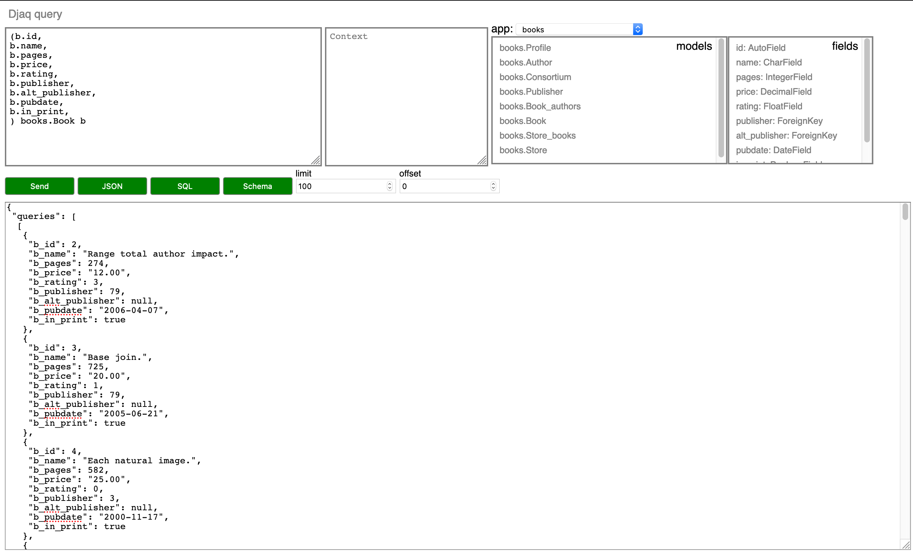

Installation
============

You need Python 3.6 or higher and Django 2.1 or higher.

Install:

.. code:: shell

    pip install Djaq

The bleeding edge experience:

.. code:: shell

    pip install https://github.com/paul-wolf/djaq/archive/master.zip

Now you can call the Djaq API:

.. code:: python

    from djaq.query import DjangoQuery as DQ

    print(list(DQ("(b.name as title, b.publisher.name as publisher) Book b").dicts()))

    [{'title': 'Name grow along.', 'publisher': 'Long, Lewis and Wright'}, {'title': 'We pay single record.', 'publisher':\
    'Long, Lewis and Wright'}, {'title': 'Natural develop available manager.', 'publisher': 'Long, Lewis and Wright'}, {'\
    title': 'Fight task international.', 'publisher': 'Long, Lewis and Wright'}, {'title': 'Discover floor phone.', 'publi\
    sher': 'Long, Lewis and Wright'}]

Providing a Remote API
----------------------

We'll assume below you are installing the Djaq UI. This is not
required to provide an API but is useful to try things out.

Install the API and UI in settings:

.. code:: python

    INSTALLED_APPS = (
        '...',
        djaq.djaq_api,
        djaq.djaq_ui,
    )

Configure urls in urls.py:

.. code:: python

    urlpatterns = [
        '...',
        path("dquery/", include("djaq.djaq_ui.urls")),
        path("djaq/", include("djaq.djaq_api.urls")),
    ]

You are done. You can start sending requests to:

.. code:: shell

    /djaq/api/request/

The UI will be available at:

.. code:: shell

    /dquery

Note the UI will send requests to the API endpoint so will not work
without that being configured. You send a request in this form to the
api endpoint:

.. code:: json

    {
        "queries": [
            {
                "q": "(b.id,b.name,b.pages,b.price,b.rating,b.publisher,b.alt_publisher,b.pubdate,b.in_print,) books.Book b",
                "context": {},
                "limit": "100",
                "offset": "0"
            }
        ]
    }

The UI will create this JSON for you if you want to avoid typing it.

You can also create objects, update them and delete them:

.. code:: json

    {
        "queries": [
            {
                "q": "(b.id,b.name,b.pages,b.price,b.rating,b.publisher,b.alt_publisher,b.pubdate,b.in_print,) books.Book b",
                "context": {},
                "limit": "100",
                "offset": "0"
            }
        ],
        "creates": [
            {
                "_model": "Book",
                "name": "my new book"
            }
        ],
        "updates": [
            {
                "_model": "Book",
                "_pk": 37,
                "name": "my new title"
            }
        ],
        "deletes": [
            {
                "_model": "Book",
                "_pk": 37
            }
        ]
    }

You can send multiple `queries`, `creates`, `updates`, `deletes` operations in a single request.

